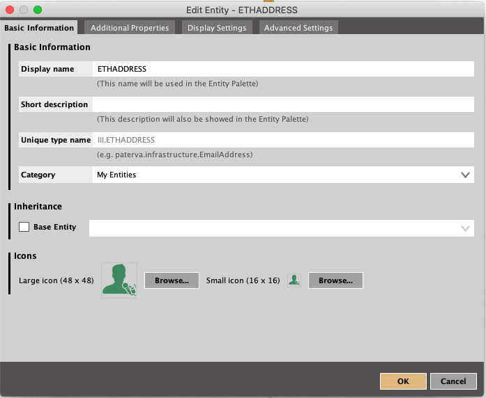

# blockchain-snademo

Demo results:


### Getting Start
```
go mod vendor
# init database
go run main.go --seed=true
# for test
cd test && go test
```
ps. please remember to change `.env` or `.env.test`

### Example for Setting Maltego Local Transform
Entities



LocalTransformg


